# Dynamic Generative Structure-Based Drug Design Pipeline

## Overview
[Diagram for the Dynamic Generative Structure-Based Drug Design Pipeline](figs/diagram.svg)



## Requirements & Installation

### Core Software Stack

The following versions are recommended for the pipeline[cite: 271]:

| Component | Software | Version | Role |
| :--- | :--- | :--- | :--- |
| **Dynamics** | BioEmu | v1.1 | Protein Ensemble Generation |
| **Clustering** | MDTraj / PyEMMA | 1.9.9 / 2.5.7 | Ensemble Reduction & Selection |
| **Docking** | Uni-Dock | v1.1 | High-Throughput Pose Generation |
| **Rescoring** | Gnina | v1.0+ | High-Fidelity Affinity Filtering |
| **Generator** | FLOWR.ROOT | v1.0 | Ligand Design & Affinity Prediction |
| **Validation** | PoseBusters | v0.2.0 | Physical & Chemical Sanity Checks |

### Environment Setup

It is recommended to use Conda to manage dependencies. The `bioemu` package requires specific extensions for MD tools used in refinement[cite: 59].

```bash
# Create environment
conda create -n bioemu_env python=3.10
conda activate bioemu_env

# Installation of the core package and MD extension
pip install bioemu
pip install bioemu[md]   # Installs HPacker, OpenMM, and other MD tools
```

<!-- This repository houses a state-of-the-art computational pipeline for Structure-Based Drug Design (SBDD) that transitions from traditional static methods toward a dynamic, probabilistic understanding of molecular recognition -->

<!-- Traditional SBDD relies on static crystal structures, which often represent single, low-energy minima and miss transient, bioactive conformations such as "cryptic" pockets [cite: 5-7]. To overcome this "static trap," this pipeline integrates biomolecular emulation with geometric deep learning [cite: 15-17]. -->

<!-- We utilize **BioEmu** to generate thermodynamic ensembles of the target protein directly from sequence, capturing functional motions and rare states[cite: 26, 52]. These ensembles are used to create a synthetic training dataset to fine-tune **FLOWR.ROOT**, an SE(3)-equivariant flow matching generative model[cite: 14, 177]. This results in a generator explicitly tailored to the dynamic conformational landscape of the target protein[cite: 15]. -->

<!-- Pipeline Workflow

The following diagram outlines the four-phase process implemented in this repository: -->


## Detailed Functionality

### Phase I: Constructing the Target Ensemble with BioEmu
Instead of relying on a single PDB file, we generate a high-quality structural ensemble that reflects the protein's solution-state dynamics.
* **BioEmu Sampling:** We use BioEmu trained on aggregate MD data to predict the equilibrium distribution of structures from the amino acid sequence. We typically generate 5,000+ samples to populate the tails of the distribution where cryptic states reside.
* **Refinement:** Raw samples undergo sidechain repacking and NVT equilibration (using OpenMM) to resolve subtle clashes and ensure physical viability.
* **Ensemble Reduction:** To create a diverse, representative training set, refined structures are clustered based on binding pocket RMSD using MDTraj, reducing the ensemble to approximately 50 distinct representative states.

### Phase II: Generating Synthetic Training Data
FLOWR.ROOT requires protein-ligand pairs for supervised training. We generate a high-fidelity "Synthetic Holo-Set" by docking diverse libraries into our ensemble representatives
* **Massive Batch Docking:** We utilize **Uni-Dock** for its extreme GPU-accelerated throughput to execute large-scale virtual screening against all cluster representatives.
* **High-Fidelity Rescoring:** Generated poses are rescored using **Gnina's** deep learning CNN scoring function, which is superior at distinguishing real biological binding modes from artifacts.
* **Data Engineering:** Poses are filtered for high CNN scores (>0.9) and predicted affinity, then featurized and serialized into LMDB format for high-performance I/O during training

### Phase III: Fine-Tuning FLOWR.ROOT
We adapt the generalist FLOWR.ROOT foundation model to the specific geometric and electrostatic boundary conditions of the target protein's dynamic pocket
* **Flow Matching Architecture:** FLOWR.ROOT uses Continuous Normalizing Flows to learn a time-dependent vector field that transports a prior noise distribution to valid ligand structures, respecting SE(3)-equivariance
* **Low-Rank Adaptation (LoRA):** To prevent catastrophic forgetting of general chemical rules, we apply LoRA adapters to the model's cross-attention layers while freezing the backbone weights
* **Joint Training:** The model is trained with a combined loss function, optimizing both the flow matching objective for structure generation and MSE loss for the joint affinity prediction head
### Phase IV: Inference, Steering, and Validation
Once fine-tuned, the model serves as a bespoke generator for the target, followed by rigorous physics-based validation
* **Affinity Steering:** During inference, we generate thousands of trajectories by solving the ODE and use the trained affinity head to perform importance sampling, prioritizing high-affinity "super-binders"
* **PoseBusters Validation:** Generated ligands are subjected to the **PoseBusters** suite to ensure chemical validity, planarity, correct bond geometry, and the absence of severe protein-ligand clashes
* **Redocking Consistency:** As a final orthogonal check, valid ligands are redocked using Gnina. A low Self-Consistency RMSD (< 2.0 Å) indicates the generative model found a stable energy minimum supported by physics-based docking
